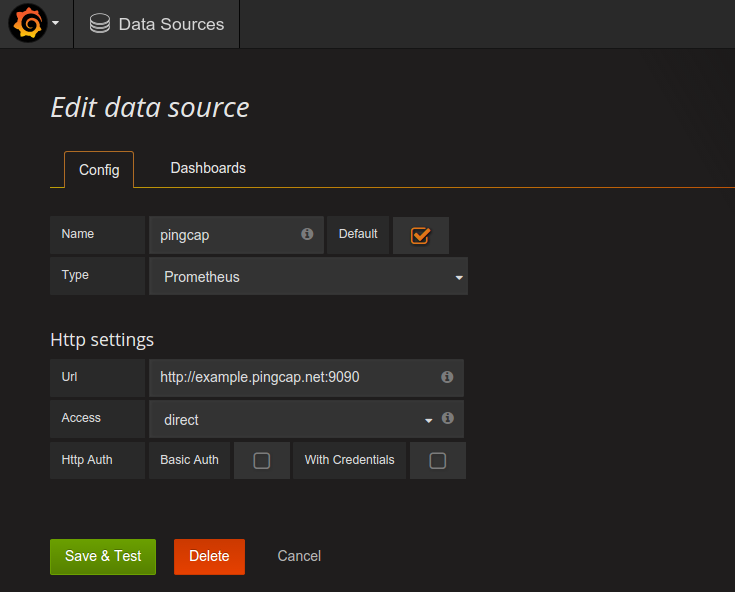

# Use prometheus in TiDB

this page shows you how to deploy prometheus and grafana.

##Preparation
Before you start, make sure that: 

+ Installed the [Pushgateway](https://github.com/prometheus/pushgateway) and [Prometheus](https://prometheus.io/docs/introduction/install)
+ Started the TiDB with [metrics-addr](https://github.com/pingcap/docs/blob/master/op-guide/configuration.md#--metrics-addr)

## Step 1. Configure the Prometheus

As an example of `prometheus.yml`:

```
#global config
global:
  scrape_interval:     15s # By default, scrape targets every 15 seconds.

# A scrape configuration containing exactly one endpoint to scrape:
# Here it's Prometheus itself.

# scrape_configs:
# The job name is added as a label `job=<job_name>` to any timeseries scraped from this config.
#  - job_name: 'prometheus'

#    Override the global default and scrape targets from this job every 5 seconds.
#    scrape_interval: 5s
#    static_configs:
#      - targets: ['localhost:9090']

scrape_configs:
  - job_name: "cluster"

    # Override the global default and scrape targets from this job every 5 seconds.
    # scrape_interval: "5s"

    # honor_labels controls how Prometheus handles conflicts between labels that are
    # already present in scraped data and labels that Prometheus would attach
    # server-side ("job" and "instance" labels, manually configured target
    # labels, and labels generated by service discovery implementations).
    #
    # If honor_labels is set to "true", label conflicts are resolved by keeping label
    # values from the scraped data and ignoring the conflicting server-side labels.
    #
    # If honor_labels is set to "false", label conflicts are resolved by renaming
    # conflicting labels in the scraped data to "exported_<original-label>" (for
    # example "exported_instance", "exported_job") and then attaching server-side
    # labels. This is useful for use cases such as federation, where all labels
    # specified in the target should be preserved.
    
    honor_labels: true

    # metrics_path defaults to '/metrics'
    # scheme defaults to 'http'.
    # here target used pushgateway address.
    static_configs:
      - targets: ['192.168.199.118:9091'] 

```

Set `honor_labels:true` if you use pushgateway. and if you use docker start tidb, you should add option `-h $HOSTNAME` to define hostname in docker. After that, you can start prometheus with `prometheus.yml`.


## Step 2. To monitor TiDB with Grafana/Prometheus
Grafana supports querying Prometheus.we use grafana to show result of querying.

Install the [Grafana](http://docs.grafana.org/)

By default, Grafana will be listening on [http://localhost:3000](). The default login is "admin" / "admin".Now,open grafana address in browser.

###Creating a Prometheus data source

- To create a Prometheus data source:
    1. Click on the Grafana logo to open the sidebar menu.
    2. Click on "Data Sources" in the sidebar.
    3. Click on "Add New".
    4. Select "Prometheus" as the type.
    5. Set the appropriate Prometheus server URL (for example, http://localhost:9090/)
    6. Adjust other data source settings as desired (for example, turning the proxy access off).
    7. Click "Add" to save the new data source.

- The following shows an example data source configuration:

    

**Note**:set datasource name as `pingcap`.we will use it in Grafana graph

###Creating a Prometheus graph in Grafana

- Follow the import way of adding a new Grafana graph. Then:
    1. Click on the Grafana logo to open the sidebar menu.
    2. Click on "Dashboards" in the sidebar.
    3. Click on "Import".
    4. Click on "Upload .json File".
    5. Upload a json file in `docs/etc`.like [tidb-grafana.json](https://github.com/pingcap/docs/blob/master/etc/tidb-grafana.json)

